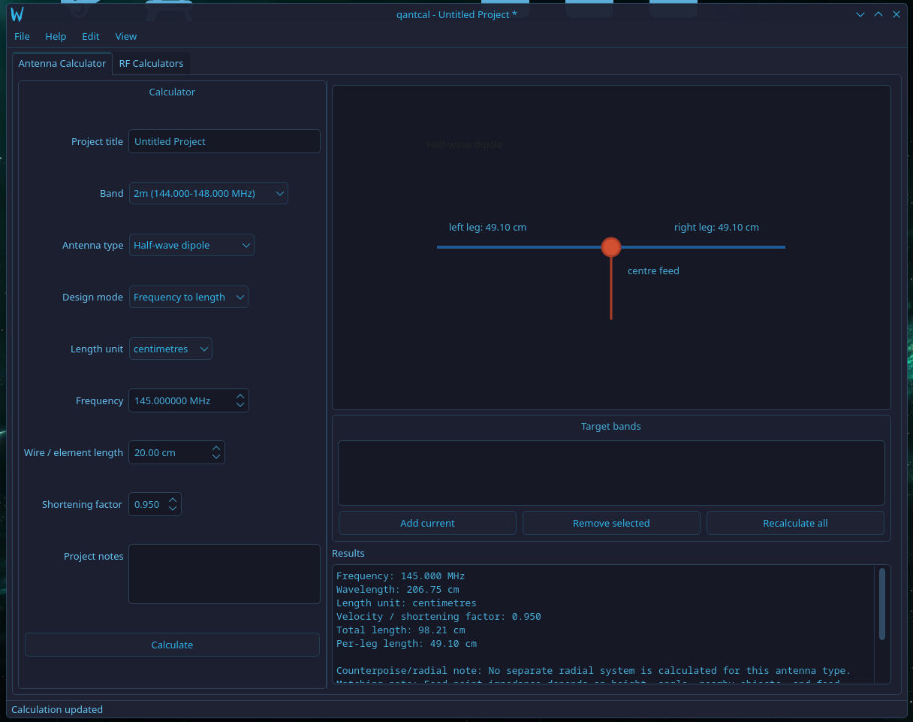
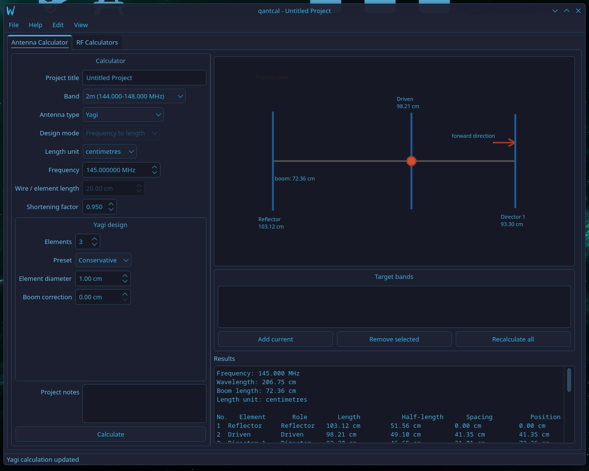
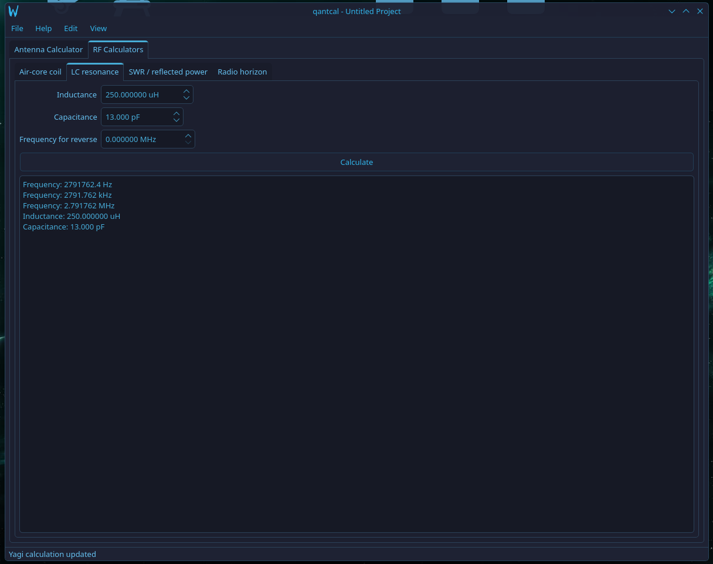

# qantcal

qantcal is an in-progress Qt6 desktop application for amateur radio / RF antenna design and calculation. The goal is to help radio amateurs and shortwave listeners produce starting dimensions for common receive or legally authorised transmit antennas, sketch simple designs, and print practical build guides.

## Table of Contents

- [Status](#status)
- [Planned Features](#planned-features)
- [Screenshots](#screenshots)
- [Building](#building)
- [Documentation](#documentation)
- [Packaging](#packaging)
- [License](#license)

## Status

qantcal uses C++17 and Qt6 Widgets. It is early-stage software, but the core calculators, project files, references, warnings, and printable guides are covered by focused tests.

Progress:

- Qt Widgets main window
- basic antenna calculator inputs with amateur and broadcast/reference band selectors
- selectable length units with saved preferences
- qantcal JSON project save/load groundwork
- simple schematic diagrams using `QGraphicsScene` and `QGraphicsView`
- simple dipole, inverted Vee, vertical, EFHW, and loop calculations
- first-pass Yagi starting dimensions for 2 to 10 elements
- basic PDF export
- printable PDF export with project sections, assumptions, and safety notes
- multi-band target guidance for fan dipoles, traps, common feedpoint caveats, and independent target calculations
- RF helper calculators for air-core coils, RF chokes, L-network matching, LC resonance, SWR/reflected power, coax loss, and radio horizon
- amateur band, broadcast/reference band, and cautious propagation notes
- LF/MF antenna guidance for full-size references, loaded verticals, top-loaded antennas, and receive-only compact antennas
- a small pure C++ calculator test executable

## Screenshots

## Planned Features

- antenna calculators for common wire and vertical antennas
- reverse length-to-frequency calculators
- multi-band design support beyond advisory target guidance
- a diagram editor for antenna layouts and printable build sheets
- printable guides and PDF exports
- RF calculators for traps, chokes, impedance helpers, and link estimates
- propagation notes and future reach estimation

Propagation and reach estimates will start as clearly labelled rough estimates. Later design work may support pluggable engines or imports from tools such as VOACAP or ITU-style models.

## Building

See [BUILDING.md](BUILDING.md) for platform notes and CMake commands.

## Documentation

- [Project plan](docs/PROJECT_PLAN.md)
- [Formulas and sources](docs/FORMULAS_AND_SOURCES.md)
- [Band reference](docs/BAND_REFERENCE.md)

## Packaging

Packaging is early groundwork only. See [PACKAGING.md](docs/PACKAGING.md) for current install and deployment notes.

## License

qantcal is released under the ISC License. See [LICENSE](LICENSE).
